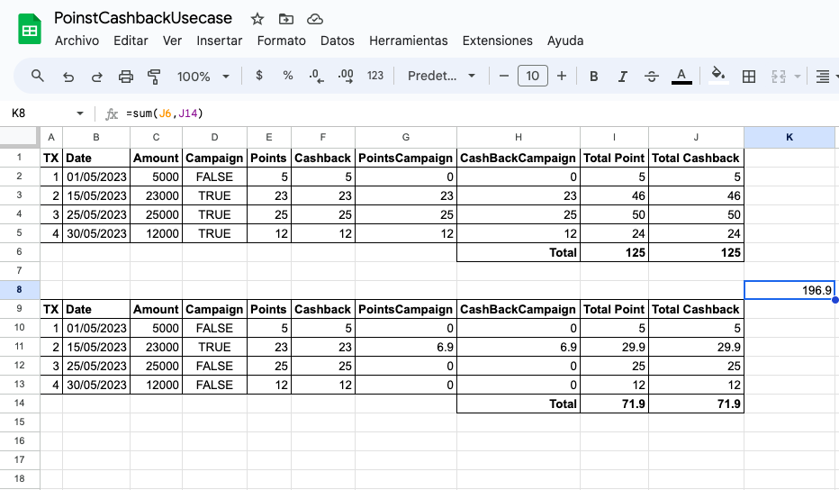

# Reto Técnico Leal Online

Leal es una innovadora startup que empodera a las personas para que ganen recompensas por sus compras diarias, al mismo tiempo que impulsa las ventas incrementales para los negocios participantes. Nuestra plataforma ofrece a los usuarios la oportunidad de adquirir Puntos Leal y/o Cashback como muestra de agradecimiento por sus compras en nuestras marcas y tiendas asociadas, siguiendo las siguientes condiciones:

### Puntos Leal:
- Los puntos se ganan según el factor de conversión establecido por el negocio participante, donde un punto equivale a un valor específico en la moneda local.
- Los puntos solo pueden ser redimidos en el negocio específico donde fueron ganados.
- La redención de puntos se realiza según la tabla de premios predefinida especificada por el negocio.

### Cashback:
- Leal Coins se ganan bajo las mismas condiciones que los puntos.
- Leal Coins pueden ser utilizados en cualquier tienda dentro de la red Leal.
- La equivalencia de redención está establecida en 1 Leal Coin = $1.

**Campañas Especiales:**
Para celebrar la apertura de dos nuevas estaciones de servicio, Texaco está ofreciendo a los usuarios la oportunidad de ganar puntos o cashback adicionales a través de una campaña especial:
- **Sucursal 1 (15-30 de mayo):** Los usuarios ganarán el doble de puntos o cashback por todas las compras realizadas durante este período.
- **Sucursal 2 (15-20 de mayo, compras > $20,000):** Los usuarios recibirán un 30% adicional en puntos o cashback por compras que excedan los $20,000.


## Requerimientos

- Golang 1.21.3 o superior (https://golang.org/dl/)
- Docker (https://docs.docker.com/get-docker/)
- Docker Compose (https://docs.docker.com/compose/install/)

## Instalación

1. Clona este repositorio en tu máquina local.
2. Ubica tu terminal en el directorio del repositorio `go-leal-challenge`.
### Construir el proyecto localmente usando docker compose:

```console
docker compose up
```
#### Puede tomar un tiempo mientras descarga las dependencias y construye el proyecto.
En este paso, se está realizando tambien el cargue del archivo [up.sql](internal/db/postgres/up.sql) con configuraciones de la base de datos.


## Uso

Despues de haber ejecutado el proyecto localmente con `docker compose` puedes validar por consola que estén los dos servicios arriba con el comando:
```bash
docker compose ps
```
Si los servicios se encuentran listos para recibir peticiones, deberá arrojar el resultado de los dos:
```bash
NAME                           IMAGE                        COMMAND                           SERVICE       CREATED          STATUS                    PORTS
leal-challenge-lc-database-1   leal-challenge-lc-database   "docker-entrypoint.sh postgres"   lc-database   35 seconds ago   Up 33 seconds (healthy)   0.0.0.0:5432->5432/tcp
leal-challenge-smb-rest-1      leal-challenge-smb-rest      "./leal-challenge-rest"           smb-rest      35 seconds ago   Up 27 seconds             0.0.0.0:8010->8010/tcp
```

## Consumir los servicios REST

Para ejecutar el servicio local, se puede hacer uso del software [curl](https://curl.se/).

### Consultar Comercios
para consultar los datos de los comercios configurados ejecutamos el siguiente comando:
```bash
curl -s localhost:8010/business/
```

obtenemos una salida similar a la siguiente:
```json
[
  {
    "id": "10cb9df0-1a5a-4f38-a5bf-df55bdb4da98",
    "name": "Texaco"
  }
]
```

### Consultar Sucursales
para consultar los datos de las sucursales necesitamos usar el `id` de la consulta previa y ejecutamos el siguiente comando:
```bash
curl -s localhost:8010/branch/business/10cb9df0-1a5a-4f38-a5bf-df55bdb4da98
```

obtenemos una salida similar a la siguiente:
```json
[
  {
    "id": "e84bd814-981c-4baf-8a11-fbf969b95b02",
    "name": "Sucursal 1",
    "business_id": "10cb9df0-1a5a-4f38-a5bf-df55bdb4da98"
  },
  {
    "id": "2a07465b-9f9d-4bec-aaf3-0b1b307bad6a",
    "name": "Sucursal 2",
    "business_id": "10cb9df0-1a5a-4f38-a5bf-df55bdb4da98"
  }
]
```


### Crear Campañas
Para crear la campaña de la sucursal 1, usaremos el `id` de la sucursal 1 y ejecutamos el siguiente comando:
```bash
curl -X POST -H "Content-Type: application/json" -d '{
    "business_id": "10cb9df0-1a5a-4f38-a5bf-df55bdb4da98",
    "branch_id": "e84bd814-981c-4baf-8a11-fbf969b95b02",
    "name": "Dobla tus puntos",
    "start_date": "2023-05-15T00:00:00-05:00",
    "end_date": "2023-05-30T23:59:59-05:00",
    "reward_multiplier": 1
}' http://localhost:8010/campaign/
```

Para crear la campaña de la sucursal 2, usaremos el `id` de la sucursal 2 y ejecutamos el siguiente comando:
```bash
curl -X POST -H "Content-Type: application/json" -d '{
    "business_id": "10cb9df0-1a5a-4f38-a5bf-df55bdb4da98",
    "branch_id": "2a07465b-9f9d-4bec-aaf3-0b1b307bad6a",
    "name": "30% Adicional de puntos y cashback!",
    "start_date": "2023-05-15T00:00:00-05:00",
    "end_date": "2023-05-20T23:59:59-05:00",
    "reward_multiplier": 0.3,
    "min_amount": 20000
}' http://localhost:8010/campaign/
```

### Consultar Campañas por comercio y/o sucursal
#### Consultar campañas por comercio
Para consultar campañas por comercio requerimos del `id` del comercio consultado previamente y ejecutamos el siguiente comando:

```bash
curl -s localhost:8010/campaign/business/10cb9df0-1a5a-4f38-a5bf-df55bdb4da98
```

obtenemos una salida similar a la siguiente:

```json
[
  {
    "id": "32c1d9e4-7502-418d-997b-c69837763744",
    "business_id": "10cb9df0-1a5a-4f38-a5bf-df55bdb4da98",
    "branch_id": "e84bd814-981c-4baf-8a11-fbf969b95b02",
    "name": "Dobla tus puntos",
    "start_date": "2023-05-15T00:00:00-05:00",
    "end_date": "2023-05-30T23:59:59-05:00",
    "reward_multiplier": 1
  },
  {
    "id": "45d8ed50-5704-4ce8-8454-95dc5649feb6",
    "business_id": "10cb9df0-1a5a-4f38-a5bf-df55bdb4da98",
    "branch_id": "2a07465b-9f9d-4bec-aaf3-0b1b307bad6a",
    "name": "30% Adicional de puntos y cashback!",
    "start_date": "2023-05-15T00:00:00-05:00",
    "end_date": "2023-05-20T23:59:59-05:00",
    "reward_multiplier": 0.3
  }
]
```
#### Consultar campañas por sucursal
Para consultar campañas por sucursal requerimos del `id` de cualquiera de las sucursales consultadas previamente y ejecutamos el siguiente comando:

```bash
curl -s localhost:8010/campaign/branch/2a07465b-9f9d-4bec-aaf3-0b1b307bad6a
```

obtenemos una salida similar a la siguiente:

```json
[
  {
    "id": "45d8ed50-5704-4ce8-8454-95dc5649feb6",
    "business_id": "10cb9df0-1a5a-4f38-a5bf-df55bdb4da98",
    "branch_id": "2a07465b-9f9d-4bec-aaf3-0b1b307bad6a",
    "name": "30% Adicional de puntos y cashback!",
    "start_date": "2023-05-15T00:00:00-05:00",
    "end_date": "2023-05-20T23:59:59-05:00",
    "reward_multiplier": 0.3
  }
]
```

### Acumulación de puntos y/o cashback

En la migración se realiza la inserción de transacciones para un mismo usuario en las dos sucursales. El resúmen de las transacciones repetidas para cada una de las sucursales es el siguiente:

* COP $5000 el 1 de mayo de 2023.
* COP $23000 el 15 de mayo de 2023.
* COP $25000 el 25 de mayo de 2023.
* COP $12000 el 30 de mayo de 2023.



#### Consultar acumulados según las transacciones
Para consultar los acumulados por usuario, en este caso sólo será de manera de información, ya que actualizar los datos hace que no se pueda volver a ejecutar el proceso, esto queda así a propósito.

```bash
curl -s localhost:8010/accumulate/
```

En total, este usuario con las transacciones que tiene y las dos campañas asociadas tendrían un acumulado cómo se ve en la imagen del excel:

```json
{
  "8cc8b3ce-99c8-4236-829b-ea779c75a3f6": {
    "total_points": 196,
    "total_cashback": 196.9
  }
}
```

## Deuda Técnica

Quedan pendiende las siguientes deudas técnicas:
* Implementar Swagger con Gin para generar documentación de los servicios REST.
* Completar los unit test faltantes.
* Actualizar los acumulados que tenga el usuario en sus transacciones y marcarlas para que no las vuelva a tomar otro proceso.
* El proceso de acumulación de puntos y cashback es ideal migrarlo a una implementación orientada a eventos.